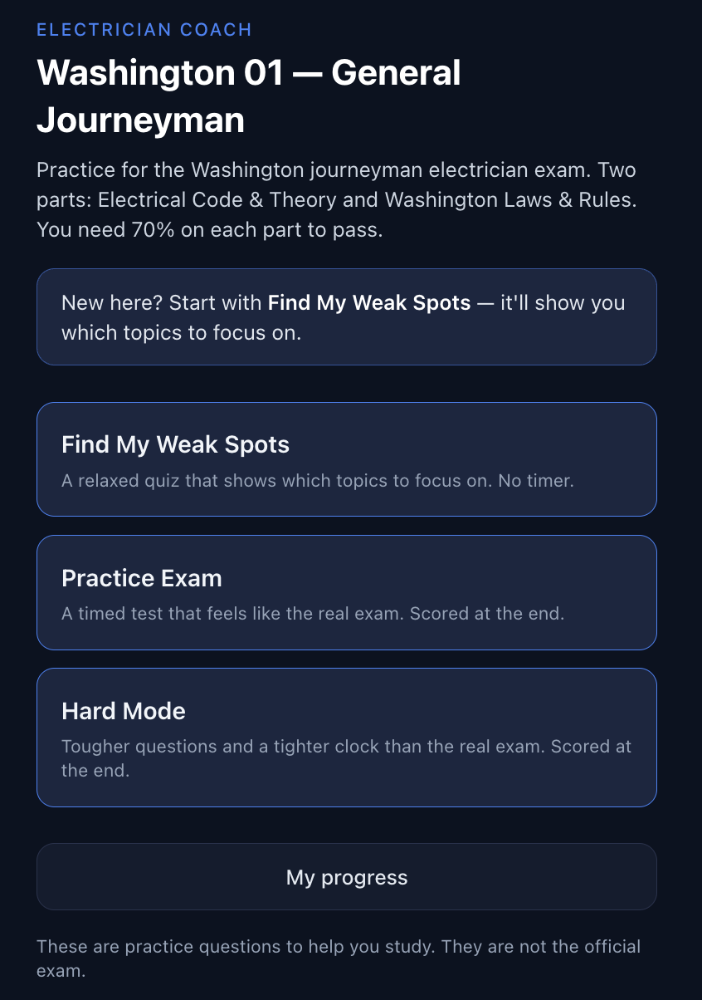
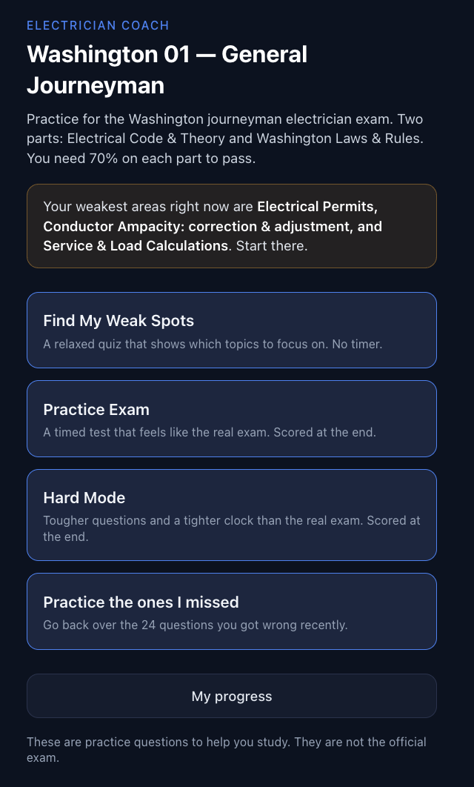
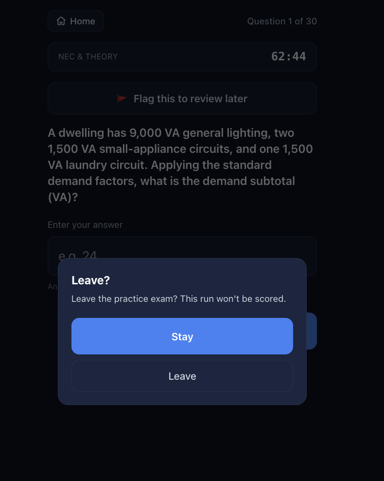
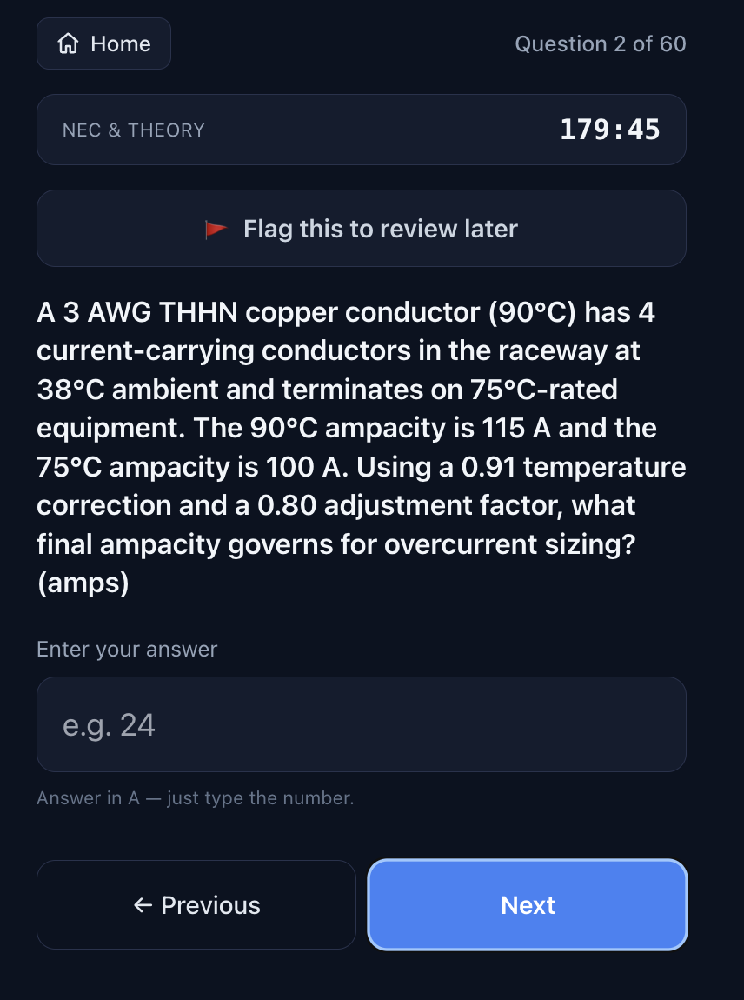
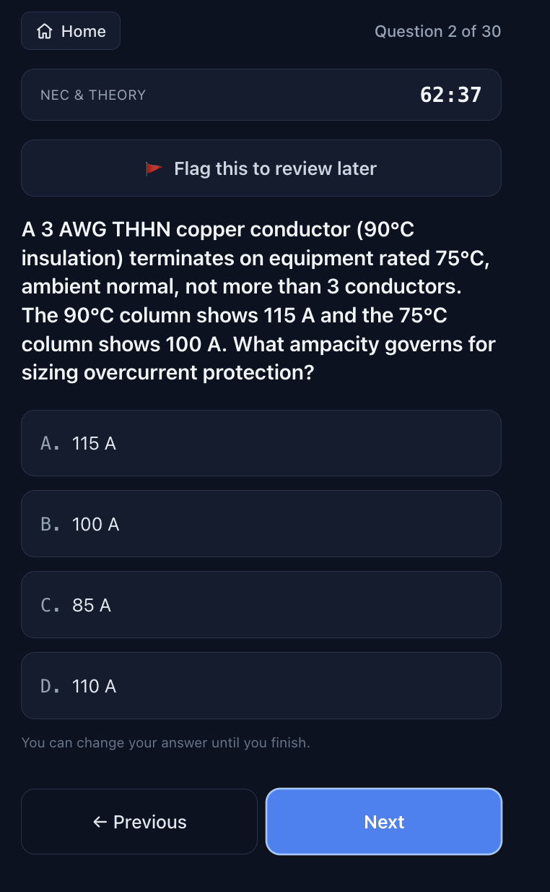
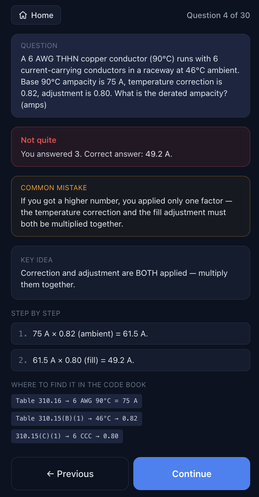
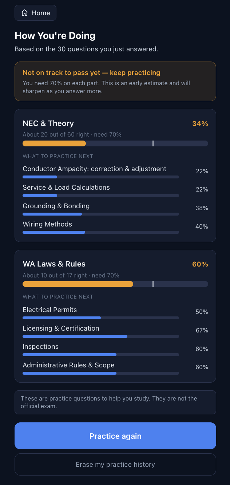
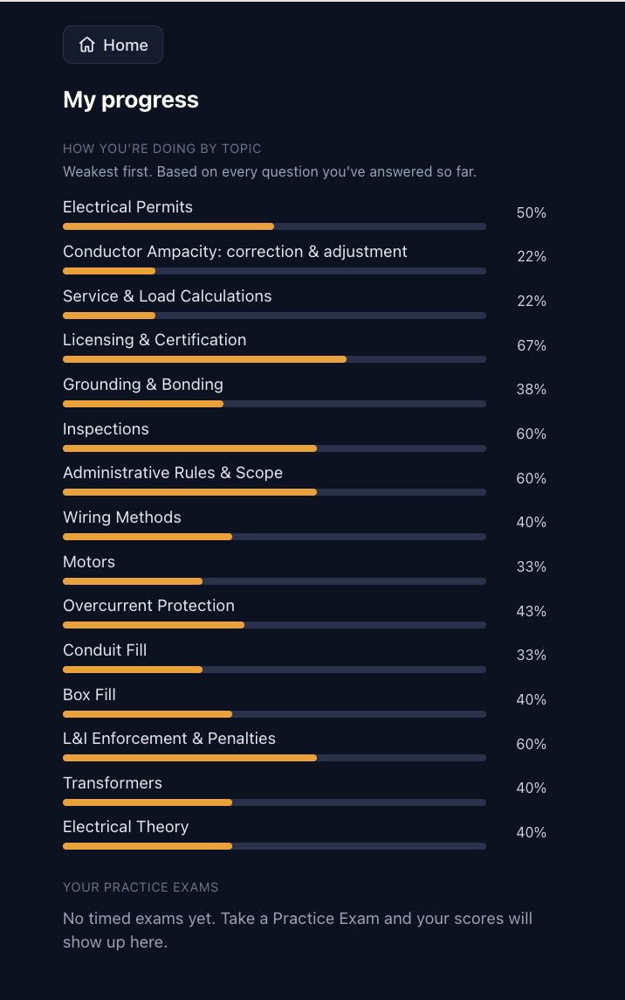

# Electrician Coach

[](https://github.com/lonivrad/electrician-coach/actions/workflows/ci.yml) [](LICENSE)

A mobile-first study app for the **Washington 01 General Journeyman** electrician
licensing exam. It finds a candidate's weak spots, drills them, and runs realistic
timed practice exams — so the real test feels easier.

**Live demo → https://electrician-coach.vercel.app/**

> Built for a working electrician preparing for the Washington 01 General
> Journeyman license — turning scattered studying into a focused, exam-realistic
> practice loop that targets the candidate's weakest topics first.

---

## 1. Context, user, and problem

### For the person studying (plain language)

The Washington 01 General Journeyman exam is **two separate tests**, and you have
to pass **each one** to get licensed:

- **NEC & Theory** — 60 questions, 3 hours. Electrical code and calculations.
- **Washington Laws & Rules** — 17 questions, 1 hour. State licensing/permit rules.

You need **70% on each part, on its own.** Acing the laws part does not make up for
a weak code part. Most of the difficulty — and most of this app — is the NEC
calculations: ampacity derating, load calcs, conduit and box fill, motors,
transformers, overcurrent, grounding.

The app does three things, in order:

1. **Find My Weak Spots** — a relaxed, untimed quiz that figures out which topics
   you're weakest on and tells you where to start.
2. **Practice Exam** — a full, timed run at real exam pace, scored at the end.
3. **Hard Mode** — tougher questions on a tighter clock, to build a cushion.

It runs in a phone browser, keeps your progress on your phone, and needs no login
or account. See [§4 Setup and usage](#4-setup-and-usage) to open it.

### For developers (why the design is non-trivial)

The naive version of this app is a randomized flashcard deck. That doesn't help
someone who's stuck, because it can't answer the only question that matters:
*what should I study next?* Getting that right requires:

- **A learning model, not a running percentage.** A raw score treats every miss
  equally. The exam doesn't — a topic worth 8 exam questions matters more than one
  worth 4, and a single unlucky miss on a rare topic shouldn't hijack the study
  queue. The app implements a weighted priority over a **shrinkage mastery
  estimate** so the "study next" list tracks what actually moves the exam score.
- **Two independently-graded sections.** Pass/fail is computed **per section**, so
  a strong section can never mask a weak one — mirroring the real exam.
- **Trustworthy content.** These are original, authored questions (real PSI items
  are copyrighted). For the numeric ones, a wrong answer is a real risk to a
  studying user, so the build **re-derives every numeric answer from encoded NEC
  tables and fails if the authored answer disagrees** (see the recompute guardrail
  in [§2](#2-solution-and-design)).
- **A clean seam for more exams.** The adaptive machinery has nothing to do with
  electricians. It's split into an **exam-agnostic engine** and a **pluggable
  content pack**, joined by a single contract — and a CI check enforces that the
  engine never reaches into content.

The stack is **React 18 + TypeScript (strict) + Vite + Tailwind**, no backend;
progress persists to the browser's `localStorage`.

---

## 2. Solution and design

### The three modes (one engine, different knobs)

A "mode" is just a bundle of selection/stop/timing knobs over the same engine
(`engine/modes/policies.ts`):

| Mode | In the app | Selection | Timing |
| --- | --- | --- | --- |
| **Find My Weak Spots** | Baseline diagnostic | information-maximizing (targets high-uncertainty domains) | untimed, immediate feedback |
| **Practice Exam** | Board simulator | blueprint-proportional draw, realistic difficulty (non-adaptive within a run) | real section pace, no feedback until the end |
| **Hard Mode** | Overtraining | weakest-first, difficulty-biased upward | compressed clock |

Two supporting flows round out the loop: **Practice the ones I missed** (a run over
just the questions you've gotten wrong and not since fixed) and **flag-for-review**
(mark any question during a timed run and review the flagged + missed ones at the
end, mirroring the real PSI mark-for-review). Neither affects scoring.

### Architecture: an exam-agnostic engine + a pluggable content pack

Everything electrician-specific lives in a **content pack** (YAML). The **engine**
is generic and imports *nothing* from content — it consumes a pack only through the
`ContentPack` contract (`engine/contracts/contentPack.ts`). Adding a future exam
(another state, another trade) is a new pack folder with **zero engine changes**,
and `npm run validate:pack` fails the build if any engine file imports content.

```
┌──────────────────────────────────────────────────────────────────────┐
│  React UI            src/ui/**   Home · DiagnosticFlow · ExamFlow ·    │
│                                  RetryFlow · ProgressView · players    │
│    │ reads only hooks + engine public surface                         │
│    ▼                                                                   │
│  State + data        src/state/  useDiagnostic · useExam              │
│                      src/data/   packLoader (YAML→pack) ·             │
│                                  progressRepo (localStorage)          │
├──────────────────────────────────────────────────────────────────────┤
│  ENGINE  engine/           exam-agnostic · imports NO content         │
│    adaptive/   mastery (Beta shrinkage) · itemSelection               │
│    scoring/    PracticePriority · ExpectedSectionScore · projection   │
│    modes/      diagnostic · board · overtrain policies                │
│    calc/       NEC calculators + encoded tables  (answer guardrail)   │
│    grade · optionOrder · types                                        │
│    contracts/contentPack.ts   ── the single seam ──                   │
├──────────────────────────────────────────────────────────────────────┤
│  CONTENT PACK   content-packs/wa-electrician-01/                       │
│    pack.yaml · blueprint.yaml · domains.yaml · traps.yaml             │
│    questions/nec-theory/**.yaml   questions/wa-laws/**.yaml           │
└──────────────────────────────────────────────────────────────────────┘
        ▲  validate:pack asserts engine/ never imports content-packs/  ▲
```

The pack is loaded once, validated at startup, and shared across every flow
(`src/data/packLoader.ts`). The same `validatePack` runs in CI and at runtime, so a
malformed pack fails loudly instead of silently degrading the model.

### Design decisions (the real ones, implemented)

- **Passing is per section, at 70%, independently.** The blueprint sets
  `cutScorePct: 0.70` on each section and `passPolicy: per-section`; a strong
  section never covers for a weak one.

- **A weighted learning model, not a raw percentage** (`engine/scoring/scoring.ts`):

  ```
  PracticePriority(domain)   = OfficialExamWeight(domain) × (1 − Mastery(domain))
  ExpectedSectionScore(sec)  = Σ_{d ∈ sec}  weight(d) × Mastery(d) / sec.totalQuestions
  PassProjection             = every section's ExpectedSectionScore ≥ its 70% cut
  ```

  The study queue is sorted worst-first by `PracticePriority`, so a high-frequency
  weak topic outranks a rare one.

- **Mastery is live-only and shrinks toward a neutral prior**
  (`engine/adaptive/mastery.ts`). It's a Beta-binomial posterior mean from a neutral
  prior (mean `0.5`, pseudo-count `4`), so a single `0/1` reads as `0.40` — barely
  off neutral — and can't spike the priority on one unlucky miss. Nothing is ever
  seeded from a past exam report; only questions the user *attempts* update it.

- **Numeric answers are machine-checked (the recompute guardrail).** Numeric
  questions carry a `recompute` spec naming an engine calculator and its inputs.
  `engine/calc/` encodes the relevant 2020 NEC tables (ampacity, temperature
  correction 310.15(B)(1), adjustment 310.15(C)(1), conduit/box fill, motor FLC,
  grounding 250.122/250.66, …) as data, and `tests/packs/recompute.test.ts`
  re-derives every authored numeric answer from those tables. A mismatch — a typo, a
  bad table cell — **fails the build.** Consistency tests
  (`tests/engine/table-consistency.test.ts`) additionally assert the tables are
  internally monotonic.

- **Answer positions are balanced.** Authored keys clustered in the first slots, so
  `engine/optionOrder.ts` re-slots each single-choice question's correct answer by
  round-robin at load time — the key spreads evenly across A/B/C/D and can't be
  guessed by position. A pack test fails the build if any position exceeds 30%.

- **The diagnostic over-weights NEC.** The candidate is already close on WA law and
  needs code prep, so **Find My Weak Spots** leans hard on the NEC section. The exam
  blueprint targets ~85% NEC & Theory questions (`TARGET_NEC_SHARE = 0.85`); a
  full-bank simulation lands around 83% due to per-section rounding. It also prefers
  questions not seen in previous runs, cycling back only once a section's unseen pool
  is spent (`src/state/useDiagnostic.ts`).

- **Provisional data is flagged, and `live` is gated.** The pack edition is set to
  2020 NEC, but **every question is still `status: draft`** pending subject-matter
  review, and the per-section/per-domain exam weights are best-estimates flagged
  `NEEDS_VERIFICATION` (no per-topic PSI breakdown was available). The validator
  surfaces every flag and **refuses to promote a `needsReview` item to `live`.**

- **The question bank is a pool larger than the exam.** There are 215 NEC & Theory
  questions for a 60-question exam; Board Simulator draws a blueprint-proportional
  60 from that pool, and the slice shifts as mastery changes between runs.

---

## 3. Artifact snapshot

A walk through the app on a phone. (Screens are the real UI in `src/ui/**`.)

### Home / mode picker



The home screen for a first-time user: the three modes — **Find My Weak Spots**,
**Practice Exam**, **Hard Mode** — plus a **My progress** link and a plain
"start with Find My Weak Spots" prompt when there's no history yet. Big, high-
contrast targets; no login, no account.

### Home after some practice — weak spots surfaced



Once there's data, the top of the home screen names the weakest areas in plain
language — *"Your weakest areas right now are Electrical Permits, Conductor
Ampacity: correction & adjustment, and Service & Load Calculations. Start there."*
— derived from the live weighted-mastery model. A **Practice the ones I missed**
shortcut appears with the count of questions to redo.

### Navigation and the exit guard



**Never lose a run by accident.** A confirm-before-you-leave guard sits over every
timed exam, alongside a live question counter — so a mis-tap mid-test can't wipe
progress. Built for a non-technical user taking the exam on a phone.

### Practice Exam — a full timed section



Practice Exam runs one whole section at real pace (NEC & Theory is 60 questions in
3 hours; the clock reads `179:45`), drawn blueprint-proportionally from the larger
pool. Each question has a large **"Flag this to review later"** toggle. There is no
feedback until you finish — like the real thing. This one is a numeric
ampacity-derating problem, entered as a plain number.

### Hard Mode — tougher items, tighter clock



Hard Mode compresses the clock (30 questions here) and biases toward harder items.
Multiple-choice options are relabeled A–D by display position after a round-robin
shuffle, so the correct answer isn't guessable by where it sits.

### Learning after a wrong answer



In Find My Weak Spots, a wrong answer restates the question, shows what you picked
vs. the correct answer, and — for numeric items — names the **likely mistake** in
one sentence ("…you applied only one factor…"). Then a **Key idea**, a numbered
worked solution, and **where to find it in the code book** (here: Table 310.16,
Table 310.15(B)(1), 310.15(C)(1)).

### Diagnostic results — "How You're Doing"



**Diagnostic results — "How You're Doing."** After the untimed Find My Weak Spots
run, a per-section pass projection and a ranked weakness map show which topics to
drill next. From here you can practice again or erase practice history.

### My progress — mastery by topic, over time



**My progress** shows per-topic mastery bars (weakest first) built from every
question answered so far — so it's useful even before the first timed exam — with a
timed-exam score history below it (empty until a Practice Exam is taken).

---

## 4. Setup and usage

### Use it (no setup)

Open **https://electrician-coach.vercel.app/** in a phone browser. It's a static
site with no backend; progress saves to that phone's local storage. On iPhone, tap
**Share → Add to Home Screen** for a tappable icon.

### Run it locally (developers)

```bash
npm install
npm run dev                 # dev server (Vite)
npm run dev -- --host       # also expose on the LAN to open on a phone
```

With `--host`, Vite prints a **Network** URL (e.g. `http://10.0.0.124:5173/`). Open
that on a phone on the **same Wi-Fi** and the app loads. (The computer must stay on
and running `npm run dev` for this LAN method; the deployed URL above needs no
computer.)

### Scripts and the CI gate

```bash
npm run build          # tsc -b + Vite production bundle → dist/
npm run preview        # serve the production build locally
npm test               # engine, pack, data, and state-hook tests (Vitest)
npm run test:coverage  # tests with a V8 coverage report (enforced thresholds)
npm run lint           # ESLint (strict typescript-eslint, type-checked rules)
npm run typecheck      # tsc -b --noEmit
npm run validate:pack  # content-pack invariants + engine/content decoupling
```

`.github/workflows/ci.yml` runs the same gate on every push to `main` and every PR,
in this order: **lint → typecheck → validate:pack → test → build.** `validate:pack`
checks the zero-coupling rule, that each section's `Σ officialExamWeight ==
totalQuestions`, that every domain/skill/trap id a question references resolves,
answer-key consistency, and the `draft`/`live` gate.

---

## 5. Repository structure

```
electrician-coach/
├─ engine/                         Exam-agnostic engine — imports NO content
│  ├─ index.ts                     The one public surface the UI/packs import
│  ├─ types.ts                     ContentPack shapes: Blueprint, Domain, Question…
│  ├─ contracts/contentPack.ts     The engine↔content seam + validatePack()
│  ├─ adaptive/mastery.ts          Beta-shrinkage mastery estimator
│  ├─ adaptive/itemSelection.ts    Selection, blueprint draw, stop rules
│  ├─ scoring/scoring.ts           PracticePriority · ExpectedSectionScore
│  ├─ modes/policies.ts            diagnostic · board · overtrain as data
│  ├─ calc/calculators.ts          NEC calculators (answer-recompute guardrail)
│  ├─ calc/tables.ts               2020 NEC tables encoded as data
│  ├─ optionOrder.ts               Round-robin answer-position balancing
│  └─ grade.ts                     Grading + unit-tolerant numeric parsing
├─ content-packs/
│  └─ wa-electrician-01/           The WA 01 pack (only electrician-specific code)
│     ├─ pack.yaml                 Manifest + code edition
│     ├─ blueprint.yaml            Sections, 70% cuts, OfficialExamWeight per domain
│     ├─ domains.yaml · traps.yaml Topics/skills + common-mistake catalog
│     └─ questions/                nec-theory/**.yaml · wa-laws/**.yaml
├─ src/
│  ├─ App.tsx · main.tsx           Screen router + mount
│  ├─ data/packLoader.ts           YAML → validated pack (once)
│  ├─ data/progressRepo.ts         localStorage persistence behind an interface
│  ├─ state/useDiagnostic.ts       Diagnostic flow (NEC-weighted, unseen-first)
│  ├─ state/useExam.ts             Timed board/overtrain/retry flow
│  └─ ui/                          Home, flows, players, results, components
├─ scripts/
│  ├─ validate-pack.ts             CI content-pack gate
│  └─ smoke-diagnostic.ts          Headless diagnostic smoke run
├─ tests/                          engine/ · packs/ · data/ · state/  (Vitest)
├─ docs/screenshots/               Images used in this README
└─ .github/workflows/ci.yml        lint · typecheck · validate:pack · test+coverage · build
```

---

## 6. Content status — please read

**These are original study drafts to practice with — not official exam questions,
and not verified reference material.** Real PSI exam items are copyrighted; every
question here is authored from scratch.

- **NEC & Theory** questions are written to the **2020 NEC** and are still
  `status: draft`, pending a subject-matter review. Their *arithmetic* is
  machine-checked (the recompute guardrail), but that catches a wrong calculation,
  not a mis-stated premise or a wrong table cell that hasn't been flagged.
- **Washington Laws & Rules** questions are cited to specific `RCW 19.28` /
  `WAC 296-46B` sections but the legal specifics (supervision ratios, CE hours,
  penalty amounts, scope wording) are **not yet confirmed** against the current
  code. Practice the concepts; verify the details.
- The **per-domain exam weights are provisional** — the PSI bulletin gives no
  per-topic breakdown, so every weight is flagged `NEEDS_VERIFICATION`.

Always defer to the official NEC code book, the current RCW/WAC, and the PSI
candidate bulletin over this app.

---

## 7. Scope, limitations, and future work

### Current scope

- One exam pack (**WA 01 General Journeyman**), 2020 NEC, single user, offline-ish.
- Persistence is local to one browser (`localStorage`) — no accounts, no sync, no
  server. Clearing site data or switching devices starts fresh.
- Content is `draft` pending SME review; blueprint weights are provisional.

### Known limitations

- **Not a PWA yet.** The app is installable via the browser's *Add to Home Screen*,
  but there's no service worker or web-app manifest, so a cold load still needs the
  network. True offline is future work.
- **No multi-question types beyond single-choice and numeric.** The schema allows
  `multi`, but no multi-select content is authored yet.
- **The diagnostic's NEC emphasis is a fixed 85%** — a deliberate, tunable constant
  rather than a per-user setting.

### Future work

- **Package it as an installable offline PWA** (service worker + manifest) so it
  runs on a phone with no network at all.
- **Second content pack** to exercise the exam-agnostic design end-to-end — another
  state's journeyman exam, a master/administrator exam, or a different trade — added
  as a new `content-packs/*` folder with zero engine changes.
- **Optional cloud sync** behind the existing `ProgressRepo` interface, so progress
  follows the user across devices without changing the engine or UI.
- **Promote content from `draft` to `live`** after a subject-matter pass, and
  replace the provisional blueprint weights once a verified per-topic breakdown is
  available.
```
